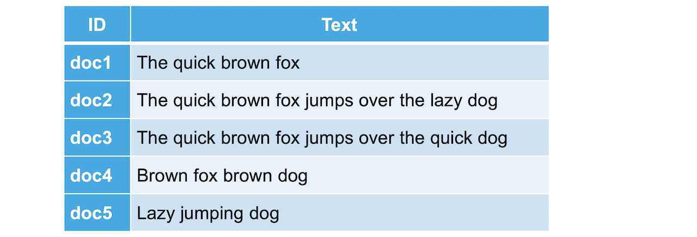
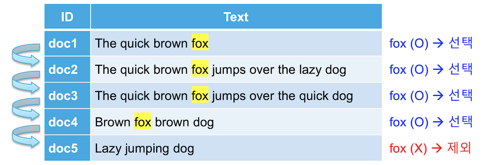
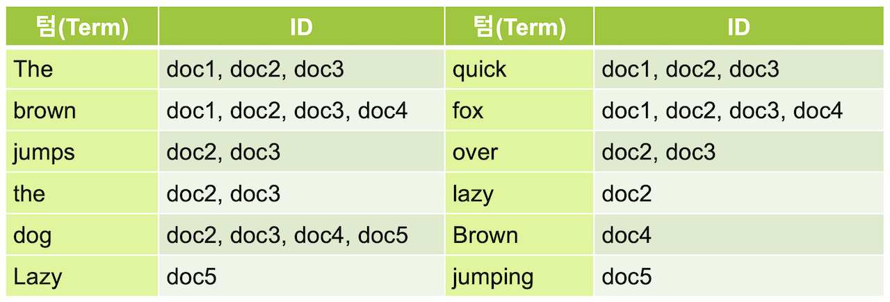

# 6.1 역 인덱스 - Inverted Index

  데이터 시스템에 다음과 같은 문서들을 저장한다고 가정 해 보겠습니다.

  일반적으로 오라클이나 MySQL 같은 관계형 DB에서는 위 내용을 보이는 대로 테이블 구조로 저장을 합니다. 만약에 위 테이블에서 Text 에 **fox**가 포함된 행들을 가져온다고 하면 다음과 같이 Text 열을 한 줄씩 찾아 내려가면서 **fox**가 있으면 가져오고 없으면 넘어가는 식으로 데이터를 가져 올 것입니다.

  전통적인 RDBMS 에서는 위와 같이 **like** 검색을 사용하기 때문에 데이터가 늘어날수록 검색해야 할 대상이 늘어나 시간도 오래 걸리고, row 안의 내용을 모두 읽어야 하기 때문에 기본적으로 속도가 느립니다. Elasticsearch는 데이터를 저장할 때 다음과 같이 **역 인덱스\(inverted index\)**라는 구조를 만들어 저장합니다.

  이 역 인덱스는 **책의 맨 뒤에 있는** 주요 키워드에 대한 내용이 몇 페이지에 있는지 볼 수 있는 **찾아보기 페이지**에 비유할 수 있습니다. Elasticsearch에서는 추출된 각 키워드를 **텀\(term\)** 이라고 부릅니다. 이렇게 역 인덱스가 있으면 **fox**를 포함하고 있는 도큐먼트들의 **id**를 바로 얻어올 수 있습니다.

  Elasticsearch는 데이터가 늘어나도 찾아가야 할 행이 늘어나는 것이 아니라 역 인덱스가 가리키는 id의 배열값이 추가되는 것 뿐이기 때문에 큰 속도의 저하 없이 빠른 속도로 검색이 가능합니다. 이런 역 인덱스를 데이터가 저장되는 과정에서 만들기 때문에 Elasticsearch는 데이터를 입력할 때 저장이 아닌 **색인**을 한다고 표현합니다.

