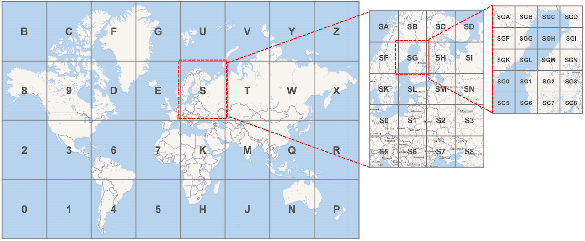
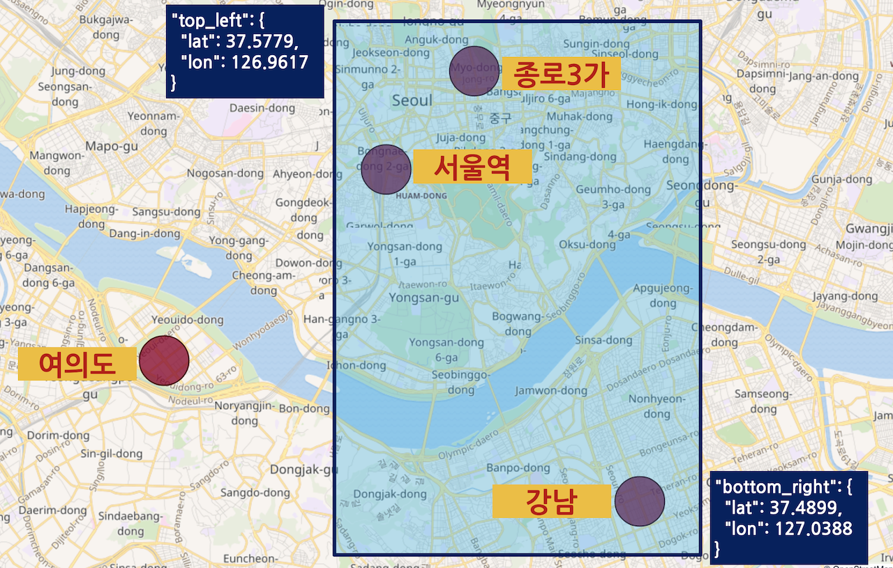
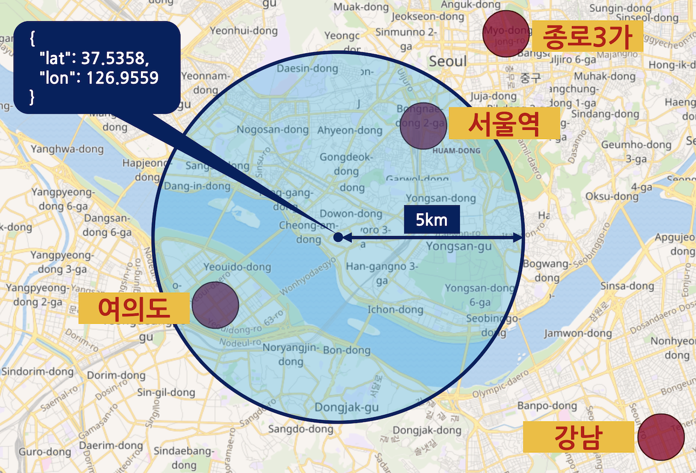
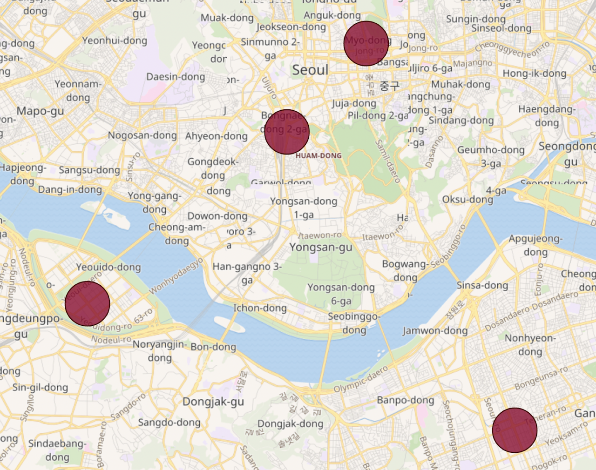
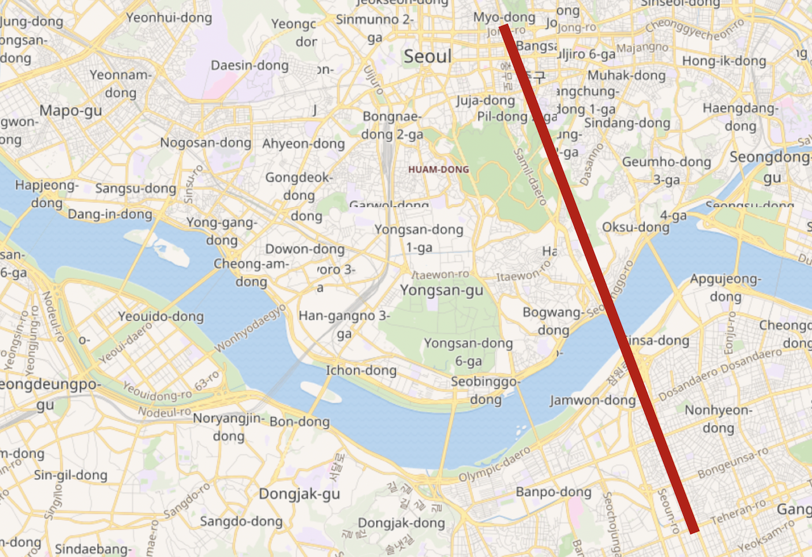
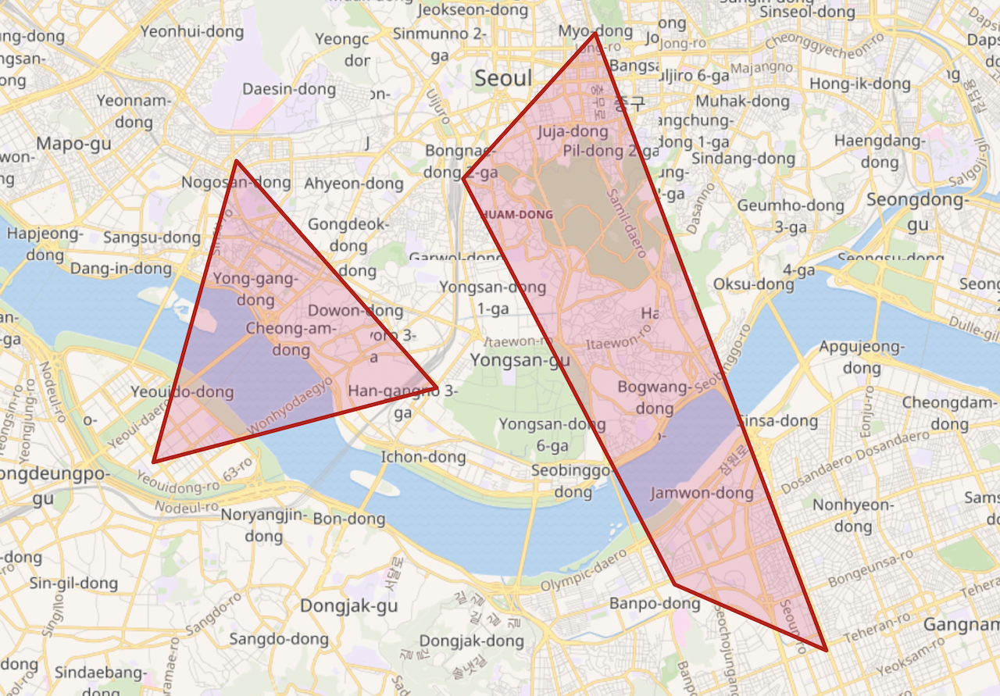
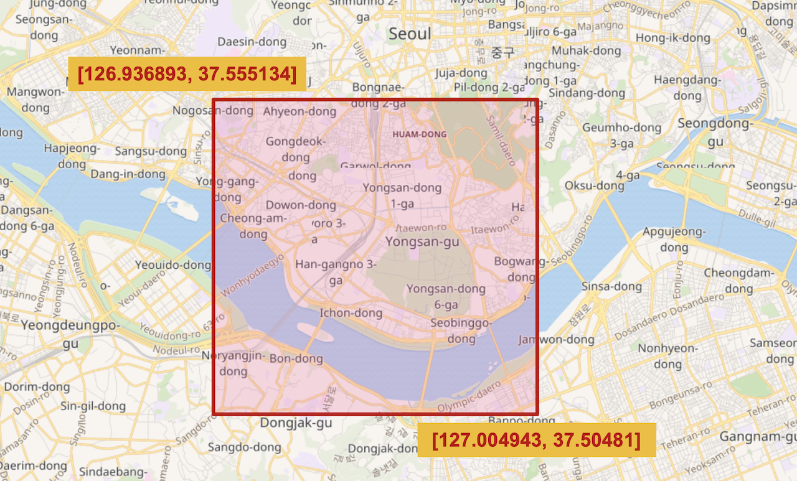

# 7.2.6 위치 정보 - Geo

  검색엔진을 사용하는 여러 서비스들 중에 요즘은 모바일 기기들을 이용해서 위치 정보를 표시하거나 검색하는 서비스들이 많이 있습니다. Elasticsearch는 자바와 기타 프로그래밍 언어에서 제공하는 기본 데이터 타입 외에도 여러가지의 추상화 된 데이터 타입들이 있습니다. 그 중에 이런 위치정보를 저장할 수 있는 **Geo Point** 와 **Geo Shape** 같은 타입들이 있습니다.

### Geo Point

  **Geo Point** 는 위도\(**latitude**\)와 경도\(**longitude**\) 두 개의 실수 값을 가지고 지도 위의 한 점을 나타내는 값입니다. Geo Point 필드의 값들은 다음과 같이 다양한 방법으로 입력이 가능합니다.


```javascript
PUT my_locations/_doc/1
{
  "location": {
    "lat": 41.12,
    "lon": -71.34
  }
}
```



```javascript
PUT my_index/_doc/2
{
  "location": "41.12,-71.34"
}
```



```javascript
PUT my_index/_doc/3
{
  "location": "drm3btev3e86"
}
```



```javascript
PUT my_index/_doc/4
{
  "location": [
    -71.34,
    41.12
  ]
}
```


  Text 와 실수 방식은 위도와 경도의 입력 순서가 서로 반대이기 때문에 헷갈리기 쉽습니다. 그래서 보통은 `{"lat": 41.12, "lon": -71.34}` 와 같이 알아보기 편한 **object** 형식으로 입력합니다.

  **geohash** 는 전 세계 지도를 바둑판 모양의 격자로 나누어 각 칸 마다 숫자와 알파벳으로 기호를 메기고, 그 칸을 다시 나누어 다시 기호를 추가하는 방식으로 표현한 것입니다. 자릿수가 커질수록 정밀도가 높아집니다. 보통 1자리 값이면 대륙, 2자리 값이면 대한민국 영토 정도의 크기이고 4자리 값이면 대도시, 7자리 값이면 길거리 한 블록 정도의 정밀도를 나타냅니다. 아래 예시에서 `sg` 값은 북유럽 스칸디나비아 반도 부근의 크기입니다.



  Geo Point 필드는 매핑에서 다음과 같이 `"type": "geo_point"` 로 선언합니다.


```javascript
PUT my_geo
{
  "mappings": {
    "properties": {
      "location": {
        "type": "geo_point"
      }
    }
  }
}
```


  Geo Point 필드의 경우는 반드시 데이터를 입력하기 전에 인덱스 매핑을 정의 해 주어야 합니다. 매핑을 정의하지 않고 `{ "location": { "lat" : 41.12, "lon": -71.34 } }` 와 같은 값을 입력하면 다이나믹 매핑으로 필드가 자동 생성될 때 geo\_point 타입의 필드가 생기는 것이 아니라 다음과 같이 **float** 타입의 **lat, lon** 두개의 하위 필드가 생깁니다.




```javascript
PUT my_geo/_doc/1
{
  "location": {
    "lat": 41.12,
    "lon": -71.34
  }
}

GET my_geo/_mapping
```





```javascript
{
  "my_geo" : {
    "mappings" : {
      "properties" : {
        "location" : {
          "properties" : {
            "lat" : {
              "type" : "float"
            },
            "lon" : {
              "type" : "float"
            }
          }
        }
      }
    }
  }
}
```




### geo\_bounding\_box 쿼리

  Elasticsearch에는 위치정보를 검색할 수 있는 다양한 쿼리들이 있습니다. **geo\_point** 값의 검색에 주로 사용 되는 것은 **geo\_bounding\_box** 쿼리와 **geo\_distance** 쿼리 입니다. 예제 위해 먼저 다음 도큐먼트들을 my\_geo 인덱스에 벌크로 입력하겠습니다. location 필드의 타입을 `"type": "geo_point"` 로 매핑을 먼저 설정해야 하는 것을 잊지 마세요.


```javascript
PUT my_geo/_bulk
{"index":{"_id":"1"}}
{"station":"강남","location":{"lon":127.027926,"lat":37.497175},"line":"2호선"}
{"index":{"_id":"2"}}
{"station":"종로3가","location":{"lon":126.991806,"lat":37.571607},"line":"3호선"}
{"index":{"_id":"3"}}
{"station":"여의도","location":{"lon":126.924191,"lat":37.521624},"line":"5호선"}
{"index":{"_id":"4"}}
{"station":"서울역","location":{"lon":126.972559,"lat":37.554648},"line":"1호선"}
```


  **geo\_bounding\_box** 쿼리는 **top\_left** 와 **bottom\_right** 두 개의 옵션에 각각 위치점을 입력하고 이 점들을 토대로 그린 네모 칸 안에 위치하는 도큐먼트들을 불러옵니다. 다음은 **{"lat": 37.4899, "lon": 127.0388}**, **{"lat": 37.5779, "lon": 126.9617}** 두 점을 기준으로 하는 네모 영역 안에 있는 도큐먼트들을 가져오는 예제입니다.




```javascript
GET my_geo/_search
{
  "query": {
    "geo_bounding_box": {
      "location": {
        "bottom_right": {
          "lat": 37.4899,
          "lon": 127.0388
        },
        "top_left": {
          "lat": 37.5779,
          "lon": 126.9617
        }
      }
    }
  }
}
```





```javascript
{
  "took" : 0,
  "timed_out" : false,
  "_shards" : {
    "total" : 1,
    "successful" : 1,
    "skipped" : 0,
    "failed" : 0
  },
  "hits" : {
    "total" : {
      "value" : 3,
      "relation" : "eq"
    },
    "max_score" : 1.0,
    "hits" : [
      {
        "_index" : "my_geo",
        "_type" : "_doc",
        "_id" : "1",
        "_score" : 1.0,
        "_source" : {
          "station" : "강남",
          "location" : {
            "lon" : 127.027926,
            "lat" : 37.497175
          },
          "line" : "2호선"
        }
      },
      {
        "_index" : "my_geo",
        "_type" : "_doc",
        "_id" : "2",
        "_score" : 1.0,
        "_source" : {
          "station" : "종로3가",
          "location" : {
            "lon" : 126.991806,
            "lat" : 37.571607
          },
          "line" : "3호선"
        }
      },
      {
        "_index" : "my_geo",
        "_type" : "_doc",
        "_id" : "4",
        "_score" : 1.0,
        "_source" : {
          "station" : "서울역",
          "location" : {
            "lon" : 126.972559,
            "lat" : 37.554648
          },
          "line" : "1호선"
        }
      }
    ]
  }
}
```




  `"station" : "강남"`, `"station" : "종로3가"`, `"station" : "서울역"` 총 3개의 결과가 리턴 되었습니다. 위 쿼리 내용을 지도에 표현 해 보면 다음과 같습니다.



### geo\_distance 쿼리

  **geo\_distance** 쿼리는 하나의 위치점을 찍고 **distance** 옵션을 이용해서 입력한 반경의 원 안에 있는 도큐먼트들을 불러옵니다. 다음은 **{"lat": 37.5358, "lon": 126.9559}** 기준으로 **반경 5킬로미터** 안에 있는 도큐먼트들을 불러오는 예제입니다.




```javascript
GET my_geo/_search
{
  "query": {
    "geo_distance": {
      "distance": "5km",
      "location": {
        "lat": 37.5358,
        "lon": 126.9559
      }
    }
  }
}
```





```javascript
{
  "took" : 71,
  "timed_out" : false,
  "_shards" : {
    "total" : 1,
    "successful" : 1,
    "skipped" : 0,
    "failed" : 0
  },
  "hits" : {
    "total" : {
      "value" : 2,
      "relation" : "eq"
    },
    "max_score" : 1.0,
    "hits" : [
      {
        "_index" : "my_geo",
        "_type" : "_doc",
        "_id" : "3",
        "_score" : 1.0,
        "_source" : {
          "station" : "여의도",
          "location" : {
            "lon" : 126.924191,
            "lat" : 37.521624
          },
          "line" : "5호선"
        }
      },
      {
        "_index" : "my_geo",
        "_type" : "_doc",
        "_id" : "4",
        "_score" : 1.0,
        "_source" : {
          "station" : "서울역",
          "location" : {
            "lon" : 126.972559,
            "lat" : 37.554648
          },
          "line" : "1호선"
        }
      }
    ]
  }
}
```




  `"station" : "여의도"`, `"station" : "서울역"` 총 2개의 결과가 리턴되었습니다. **distance** 값을 10km, 20km 등으로 변경해서 다시 쿼리를 해 보면 종로3가, 강남이 결과에 나타나는 것도 확인할 수 있습니다. 위 쿼리를 지도에 표시 해 보면 다음과 같습니다.



### Geo Shape

  앞에서 살펴본 Geo Point 는 위도 경도 두개의 값을 가진 1차원 데이터 "점" 입니다. Elasticsearch 에서 사용 가능한 또 다른 위치정보 타입인 **Geo Shape** 은 선, 면 등의 2차원 값을 저장하고 쿼리할 수 있습니다. Geo Shape 필드는 `"type": "geo_shape"` 으로 선언합니다.


```javascript
PUT my_shape
{
  "mappings": {
    "properties": {
      "location": {
        "type": "geo_shape"
      }
    }
  }
}
```


  도큐먼트에도 점, 선, 다중점, 다중선, 다각형 등을 `"type"` 값에 각각 다음과 같이 지정하고 `"coordinates"` 값에 위치 정보를 **\[ -71.34, 41.12 \]** 같이 **\[경도, 위도\]** 의 순서로 배열 형식으로 입력합니다. 위치정보 순서가 반대로 되면 엉뚱한 값이 되기 때문에 주의해야 합니다.

* `"type": "point"` - 단일 점 입니다. 보통은 geo\_point 와 같은 용도로 사용됩니다.


```javascript
PUT my_shape/_doc/1
{
  "location": {
    "type": "point",
    "coordinates": [
      127.027926,
      37.497175
    ]
  }
}
```



* `"type": "multipoint"` - 여러 점을 하나의 값으로 저장합니다. 점들을 배열로 입력합니다.


```javascript
PUT my_shape/_doc/2
{
  "location": {
    "type": "multipoint",
    "coordinates": [
      [ 127.027926, 37.497175 ],
      [ 126.991806, 37.571607 ],
      [ 126.924191, 37.521624 ],
      [ 126.972559, 37.554648 ]
    ]
  }
}
```




* `"type": "linestring"` - 점 2개 값를 배열로 입력하여 두 점을 잇는 **직선**을 저장합니다. 비행 경로 등을 저장할때 유용합니다.


```javascript
PUT my_shape/_doc/3
{
  "location": {
    "type": "linestring",
    "coordinates": [
      [ 127.027926, 37.497175 ],
      [ 126.991806, 37.571607 ]
    ]
  }
}
```




* `"type": "multilinestring"` - 여러개의 직선을 배열로 입력하여 저장합니다.


```javascript
PUT my_shape/_doc/4
{
  "location": {
    "type": "multilinestring",
    "coordinates": [
      [
        [ 127.027926, 37.497175 ],
        [ 126.991806, 37.571607 ]
      ],
      [
        [ 126.924191, 37.521624 ],
        [ 126.972559, 37.554648 ]
      ]
    ]
  }
}
```



* `"type": "polygon"` - 다각형을 저장합니다. 내부에 배열을 추가하고 점들을 배열로 입력하며 순서대로 이어집니다. **배열 마지막에는 반드시 처음과 같은 점이 입력되어야 합니다.** 영토 정보 등을 저장할때 유용합니다.


```javascript
PUT my_shape/_doc/5
{
  "location": {
    "type": "polygon",
    "coordinates": [
      [
        [ 127.027926, 37.497175 ],
        [ 126.991806, 37.571607 ],
        [ 126.924191, 37.521624 ],
        [ 126.972559, 37.554648 ],
        [ 127.027926, 37.497175 ]
      ]
    ]
  }
}
```



* `"type": "multipolygon"` - 여러 개의 다각형을 배열로 저장합니다. 미국의 알래스카, 하와이, 본토 등과 같이 분리된 영토를 같이 저장하는데 유용합니다.


```javascript
PUT my_shape/_doc/6
{
  "location": {
    "type": "multipolygon",
    "coordinates": [
      [
        [
          [ 127.027926, 37.497175 ],
          [ 126.991806, 37.571607 ],
          [ 126.924191, 37.521624 ],
          [ 127.004943, 37.504810 ],
          [ 127.027926, 37.497175 ]
        ]
      ],
      [
        [
          [ 126.936893, 37.555134 ],
          [ 126.967894, 37.529170 ],
          [ 126.924191, 37.521624 ],
          [ 126.936893, 37.555134 ]
        ]
      ]
    ]
  }
}
```




* `"type": "envelope"` - 바른 각도의 직사각형 영역을 저장할때는 **polygon** 으로 4개의 점을 입력하여 지정할 수도 있지만, 대신 **envelope** 을 사용하면 좌측 **상단\(upper left\)** 와 **우측 하단\(lower right\)** 점 두개만 이용해서 그리는 것도 가능합니다.


```javascript
PUT my_shape/_doc/7
{
  "location": {
    "type": "envelope",
    "coordinates": [
      [ 126.936893, 37.555134 ],
      [ 127.004943, 37.50481 ]
    ]
  }
}
```





6.5 이전 버전 까지는 한 점의 coordinates 와 `"radius": "5km"` 같은 반경을 지정하는 값을 이용해서 `"type": "circle"` 인 원 형태의 데이터도 사용이 가능했습니다. 버전6.6 부터는 geo\_shape 데이터의 저장 방식이 변경되면서 6.6 버전 이후 부터 필자가 글을 쓰고 있는 현재 7.4 버전에서의 원 형태의 데이터는 지원하지 않고 있습니다. 이후 다시 구현 될 가능성은 있습니다.


### geo\_shape 쿼리

  Geo Shape 타입의 값들을 검색하려면 **geo\_shape** 쿼리를 사용해야 합니다. 입력해야하는 옵션으로는 `"shape": { }` 에 검색할 영역의 `"type"` 과 `"coordinates"` 값을 입력하고, `"relation"` 에 검색할 영역과 검색되는 도큐먼트가 겹치거나 포함되는 관계 조건 값을 입력합니다. relation 옵션에 입력 가능한 값은 **intersects**, **disjoint**, **within** 3가지가 있습니다.

* `"relation": "intersects"` - 디폴트 값입니다. 쿼리 영역과 도큐먼트 값 영역이 일부라도 겹쳐지면 참 입니다.
* `"relation": "disjoint"` - 도큐먼트 값 영역이 쿼리 영역과 겹치지 않는 쿼리 영역 바깥에 있는 도큐먼트들을 가져옵니다.
* `"relation": "within"` - 도큐먼트의 값들이 모두 쿼리 영역 안에 완전히 포함 되어 있는 도큐먼트들을 가져옵니다.

  예제 실행을 위해 my\_shape 인덱스에 다음 세 개의 **envelope** 방식의 **geo\_shape** 값을 입력하겠습니다. 먼저 **location** 필드의 매핑을 `"type": "geo_shape"` 으로 지정해야 하는 것을 명심하세요.


```javascript
PUT my_shape/_doc/1
{
  "place": "경복궁",
  "location": {
    "type": "envelope",
    "coordinates": [
      [ 126.9735, 37.5837 ],
      [ 126.9802, 37.5756 ]
    ]
  }
}

PUT my_shape/_doc/2
{
  "place": "명동",
  "location": {
    "type": "envelope",
    "coordinates": [
      [ 126.9778, 37.5656 ],
      [ 126.9884, 37.5558 ]
    ]
  }
}

PUT my_shape/_doc/3
{
  "place": "홍대",
  "location": {
    "type": "envelope",
    "coordinates": [
      [ 126.9199, 37.5583 ],
      [ 126.9347, 37.5481 ]
    ]
  }
}
```


  이제 **geo\_shape** 쿼리를 이용해서 **"top\_left": {"lat": 37.5800, "lon": 126.9687}**, **"bottom\_right": {"lat": 37.5543, "lon": 126.9900}** 의 직사각형 \(envelope\) 범위 안에 있는 도큐먼트 들을 relation 별로 검색을 해 보겠습니다. 먼저 위에 입력한 도큐먼트와 이후 검색할 쿼리 범위를 지도에 표시하면 다음과 같습니다.


  다음은 **geo\_shape** 쿼리의 **relation** 값을 각각 **intersects**, **within**, **disjoint** 한 결과입니다.




```javascript
GET my_shape/_search
{
  "query": {
    "geo_shape": {
      "location": {
        "shape": {
          "type": "envelope",
          "coordinates": [
            [ 126.9687, 37.58 ],
            [ 126.99, 37.5543 ]
          ]
        },
        "relation": "intersects"
      }
    }
  }
}
```





```javascript
{
  "took" : 2,
  "timed_out" : false,
  "_shards" : {
    "total" : 1,
    "successful" : 1,
    "skipped" : 0,
    "failed" : 0
  },
  "hits" : {
    "total" : {
      "value" : 2,
      "relation" : "eq"
    },
    "max_score" : 1.0,
    "hits" : [
      {
        "_index" : "my_shape",
        "_type" : "_doc",
        "_id" : "1",
        "_score" : 1.0,
        "_source" : {
          "place" : "경복궁",
          "location" : {
            "type" : "envelope",
            "coordinates" : [
              [
                126.9735,
                37.5837
              ],
              [
                126.9802,
                37.5756
              ]
            ]
          }
        }
      },
      {
        "_index" : "my_shape",
        "_type" : "_doc",
        "_id" : "2",
        "_score" : 1.0,
        "_source" : {
          "place" : "명동",
          "location" : {
            "type" : "envelope",
            "coordinates" : [
              [
                126.9778,
                37.5656
              ],
              [
                126.9884,
                37.5558
              ]
            ]
          }
        }
      }
    ]
  }
}
```




* `"relation": "intersects"` - 쿼리 영역에 조금이라도 걸쳐 있는 `"place" : "경복궁"` 과 `"place" : "명동"` 도큐먼트들이 결과로 나타납니다.




```javascript
GET my_shape/_search
{
  "query": {
    "geo_shape": {
      "location": {
        "shape": {
          "type": "envelope",
          "coordinates": [
            [ 126.9687, 37.58 ],
            [ 126.99, 37.5543 ]
          ]
        },
        "relation": "within"
      }
    }
  }
}
```





```javascript
{
  "took" : 1,
  "timed_out" : false,
  "_shards" : {
    "total" : 1,
    "successful" : 1,
    "skipped" : 0,
    "failed" : 0
  },
  "hits" : {
    "total" : {
      "value" : 1,
      "relation" : "eq"
    },
    "max_score" : 1.0,
    "hits" : [
      {
        "_index" : "my_shape",
        "_type" : "_doc",
        "_id" : "2",
        "_score" : 1.0,
        "_source" : {
          "place" : "명동",
          "location" : {
            "type" : "envelope",
            "coordinates" : [
              [
                126.9778,
                37.5656
              ],
              [
                126.9884,
                37.5558
              ]
            ]
          }
        }
      }
    ]
  }
}
```




* `"relation": "within"` - 쿼리 영역에 완전히 포함되어 있는 `"place" : "명동"` 도큐먼트만 결과로 나타납니다.




```javascript
GET my_shape/_search
{
  "query": {
    "geo_shape": {
      "location": {
        "shape": {
          "type": "envelope",
          "coordinates": [
            [ 126.9687, 37.58 ],
            [ 126.99, 37.5543 ]
          ]
        },
        "relation": "disjoint"
      }
    }
  }
}
```





```javascript
{
  "took" : 1,
  "timed_out" : false,
  "_shards" : {
    "total" : 1,
    "successful" : 1,
    "skipped" : 0,
    "failed" : 0
  },
  "hits" : {
    "total" : {
      "value" : 1,
      "relation" : "eq"
    },
    "max_score" : 1.0,
    "hits" : [
      {
        "_index" : "my_shape",
        "_type" : "_doc",
        "_id" : "3",
        "_score" : 1.0,
        "_source" : {
          "place" : "홍대",
          "location" : {
            "type" : "envelope",
            "coordinates" : [
              [
                126.9199,
                37.5583
              ],
              [
                126.9347,
                37.5481
              ]
            ]
          }
        }
      }
    ]
  }
}
```




* `"relation": "disjoint"` - 쿼리 영역 바깥에 있는 `"place" : "홍대"` 도큐먼트가 결과로 나타납니다.  

  이 외에도 정사각형이 아닌 다각형으로 쿼리할 수 있는 **geo\_polygon** 쿼리가 있습니다. 이 책에서 geo\_polygon 쿼리는 다루지 않으니 [공식 도큐먼트](https://www.elastic.co/guide/en/elasticsearch/reference/7.0/query-dsl-geo-polygon-query.html)를 확인 하시기 바랍니다. 앞에서 배운 쿼리들을 이해 하셨으면 공식 도큐먼트를 참고 해서 어렵지 않게 사용이 가능 할 것입니다.

